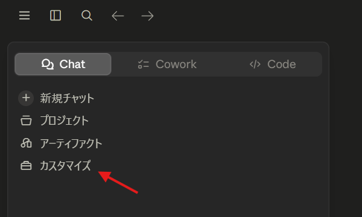

# データ連携（Connectors）

Claude に手元のデータ（Microsoft 365 など）を接続すると、**自分の資料やメール・予定をふまえた回答**が得られます。「先週の○○のメールを要約して」「この資料をもとに提案書を作って」といった使い方ができます。

## Connectors とは

Connectors（コネクタ）は、Claude と外部サービスをつなぐ仕組みです。一度つないでおくと、毎回ファイルを貼り付けなくても、Claude が必要に応じてそのサービスの情報を参照します。

!!! info "利用できる連携はプランや時期によって異なります"
    つなげるサービスの種類は、契約プランやアプリのバージョンで変わります。設定画面に表示されているものが、いま使える連携です。

## Microsoft 365 を接続する

御社の基盤である **Microsoft 365**（Outlook メール・予定表、OneDrive／SharePoint のファイル）との連携手順です。

1. 左サイドバーの **「カスタマイズ」** を開く
2. **「コネクタ」** タブを選び、コネクタの **ディレクトリ（一覧）** を開く
3. 一覧から **Microsoft 365** を選び、**「＋」** で追加する
4. ブラウザで **Microsoft のサインイン画面**が開くので、会社のアカウントでログインし、アクセスを**許可**する
5. 追加が完了すると、コネクタ一覧に表示されます




!!! warning "会社のIT管理者の承認が必要な場合があります"
    組織のポリシーによっては、管理者の許可がないと連携できないことがあります。その場合は情報システム担当にご相談ください。

!!! note "連携済みの画面について"
    本ガイドの作成環境では Microsoft 365 を接続していないため、**接続後（連携済み）の画面は、後日、該当箇所を枠線・矢印でご案内**します（実際のメールやファイルの中身は表示しません）。

## 任意の Connector を追加する（汎用手順）

Microsoft 365 以外でも、手順は共通です。

1. **「Connectors（連携）」** の画面を開く
2. つなぎたいサービスを選ぶ
3. 「接続」→ 各サービスのログイン → **アクセスを許可**
4. 一覧が「接続済み」になれば完了

不要になったら、同じ画面から **「接続を解除」** できます。

## ファイルを添付して使う

連携を設定しなくても、**その場限りでファイルを渡す**こともできます。入力欄の **「＋」** ボタン（または画面へドラッグ＆ドロップ）で、PDF・Word・Excel・画像などを添付し、「この資料を要約して」などと頼めます。

!!! tip "使い分け"
    - **Connectors** … 繰り返し使う・常に最新を参照したい → つなぎっぱなし
    - **ファイル添付** … その場の一回だけ → さっと添付

## 連携を使った依頼例

連携やファイル添付を使うと、こんな依頼ができます。

**フォーマットがバラバラな勤怠表をまとめて集計する**（出向先の社員から毎月メールで届くようなケース）：

```text
添付した複数の勤怠表は、社員ごとにフォーマットが異なります。
「氏名／所属／日付／出勤／退勤／休憩／実働／残業」の統一フォーマットの一覧にまとめ、
表記ゆれ（全角・半角や時刻表記）も揃えたうえで、社員別に実働時間と残業時間の月合計を出してください。
```

ほかにも、例えば：

- 「未読の重要メールを要約して、返信の下書きを作って」（Outlook）
- 「OneDrive の先月の◯◯資料をもとに、提案書のたたき台を作って」

!!! warning "数字は必ず人が確認を"
    集計・計算の結果は、**そのまま使わず必ず検算**してください。給与・口座番号など極めて機密性の高い情報は入力しないのが基本です（[プライバシー](settings.md) 参照）。
