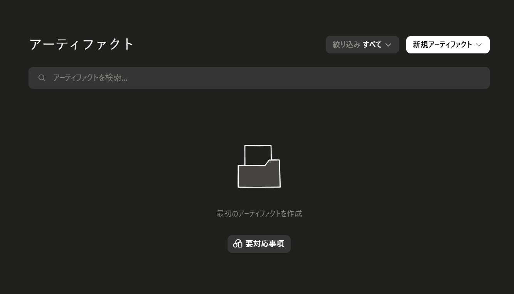
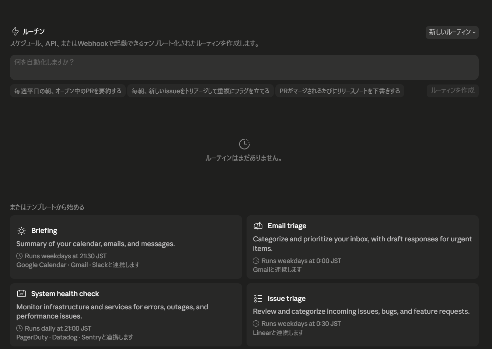

# Cowork の使い方

**Cowork（コワーク）** は、上部タブの一つで、Claude に **実務そのものを任せる「作業モード」** です。通常のチャットが「相談・作成」だとすると、Cowork は **プラグインやスキル・連携したツールを使って、成果物（資料・表・ドキュメントなど）を仕上げてもらう** イメージです。

!!! info "Chat / Cowork / Code の違い（ざっくり）"
    - **Chat** … 会話して文章や案を作る（基本）
    - **Cowork** … スキルやプラグインを使って、実務・成果物を任せる
    - **[Code](code.md)** … コードづくりや自動化

## Cowork とは

Cowork は、**道具（スキル・プラグイン・[連携](connectors.md)）を使って、複数の手順を伴う実務を最後まで仕上げてもらう**モードです。使う道具には2種類あります。

- **スキル** … 1つの作業手順をパッケージ化した「個別の技」（例：議事録を整える）
- **プラグイン** … 役割・分野ごとに、関連するスキルや設定をまとめた「道具箱（パック）」

業務に合った道具を選んで依頼すると、仕上がった成果物を **ファイルとして受け取れます**。

!!! question "Chat と何が違う?"
    - **Chat** … 会話しながら**案や文章を作る**（その場のやり取り）
    - **Cowork** … 道具と連携を使って、**複数の手順を自分でこなし、成果物（ファイル）として仕上げる**

    「相談する」のが Chat、「作業を任せて“納品物”を受け取る」のが Cowork、というイメージです。

!!! note "更新で変わることがあります"
    Cowork は機能追加が活発な領域です。画面構成や使えるプラグインは更新で増えていきます。表示が本ガイドと異なる場合は、画面の案内に従ってください。

## 始め方

1. 上部タブの **「Cowork」** を開く
2. 画面の案内に従って、**自分の役割・やりたいことに合うプラグイン／スキル** を選ぶ（必要に応じて[連携](connectors.md)も設定）
3. やってほしいことを言葉で依頼する
4. 仕上がった成果物（ファイル）を確認・ダウンロードする

## 使い方の例

データや連携をまたいで、**最後まで成果物（ファイル）に仕上げる**作業に向きます。

- 「先月の売上データ（添付）を整理して、**月次レポートの表とグラフ**にして」
- 「この議事録から、**担当者別のタスク一覧**を作って」
- 「競合3社について調べて、**比較表**にまとめて」

!!! tip
    Cowork で使う「スキル」を増やすときは、安全面に注意します。導入の考え方は [スキル（Skills）](skills.md) を参照してください。

## アーティファクト（作った成果物の管理）

Cowork や会話で Claude が作った **成果物（資料・表・コード・図など）** は、**アーティファクト**としてまとめて管理できます。「アーティファクト」を開くと、作成物の一覧・検索・新規作成ができます。

- 過去に作った資料を**後から探して再利用**できます。
- 「新規アーティファクト」から、文書などを直接作り始めることもできます。

## 定期実行・自動化（ルーチン／スケジュール）

毎日・毎週など、**決まった作業を自動で繰り返す**こともできます。朝の情報整理や定例レポートの作成を任せられます。

- **ルーチン**（Code タブ）… スケジュールや Webhook で起動する、テンプレート化した定期処理。ひな形（例：「毎朝、カレンダー・メール・メッセージを要約」）から始められます。
- **スケジュール済みタスク**（Cowork の「予定済み」）… 既存のタスクで **`/schedule`** と入力すると、定期実行を設定できます。

!!! warning "PC が起動している必要があります"
    スケジュールされたタスクは、**コンピュータがスリープ状態でない間のみ**実行されます。定期実行を使う場合は、PC をスリープさせない設定もあわせてご確認ください。
