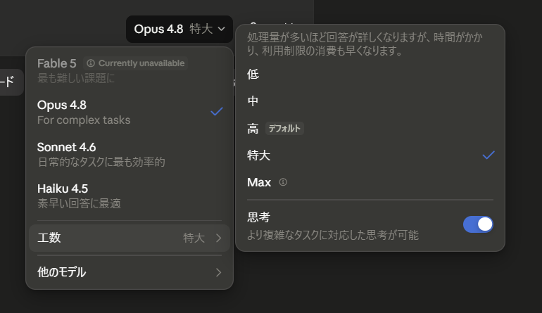

# モデルと推論レベルの選び方

Claude は **モデル（頭脳の種類）** と **工数（考える深さ）** を切り替えられます。「重要な仕事は賢いモデル＋多い工数」「日常は速いモデル」と使い分けると、**速さと精度のバランス**が取れます。

## 切り替えの場所

入力欄の**右下**に、現在のモデルと工数が表示されています（例：**`Opus 4.8` `特大`**）。ここをクリックすると、選択メニューが開きます。

## モデルの選び方

モデルは「賢さ」と「速さ」のバランスが異なります。用途で選びましょう。

| モデル | 向いている用途 | イメージ |
| --- | --- | --- |
| **Opus**（例：Opus 4.8） | 難しい判断・重要な文書・複雑な分析 | 一番賢い・じっくり |
| **Sonnet**（例：Sonnet 4.6） | 日常の作業全般 | バランス型・実用的 |
| **Haiku**（例：Haiku 4.5） | 短い質問・素早い下書き | 軽量・高速 |

最難関の課題向けに **Fable 5** が用意される場合もあります（提供状況により、選べないことがあります）。

!!! tip "迷ったら"
    まずは標準のモデルのままでOK。**「これは大事」「難しい」**と感じたときに Opus に上げると失敗が減ります。

## 工数（考える深さ）と「思考」

メニューの右側で、**「工数」**＝答えを出す前にかける手数を選べます。多いほど回答が詳しく正確になりますが、**時間がかかり、利用制限の消費も早く**なります。「人が即答するか、少し考えてから答えるか」の違いに近いものです。

- 工数は **低 → 中 → 高（デフォルト）→ 特大 → Max** の5段階。
- 重要な意思決定・込み入った分析 → **特大 / Max**
- 日常のやり取り・簡単な依頼 → **高（デフォルト）や中**

さらに **「思考」** のトグルをオンにすると、より複雑なタスクに対応した深い思考が働きます。

!!! note "速さ ↔ 精度のトレードオフ"
    「もっと慎重に考えてほしい」ときは工数を上げ、「すぐ答えがほしい」ときは下げる、と覚えておけば十分です。

## 使い分けの目安

- 役員会の資料・重要メール・契約の確認 → **Opus ＋ 工数：特大／Max**
- 議事録の要約・社内連絡の下書き → **Sonnet ＋ 工数：高**
- ちょっとした言い換え・確認 → **Haiku ＋ 工数：中**
