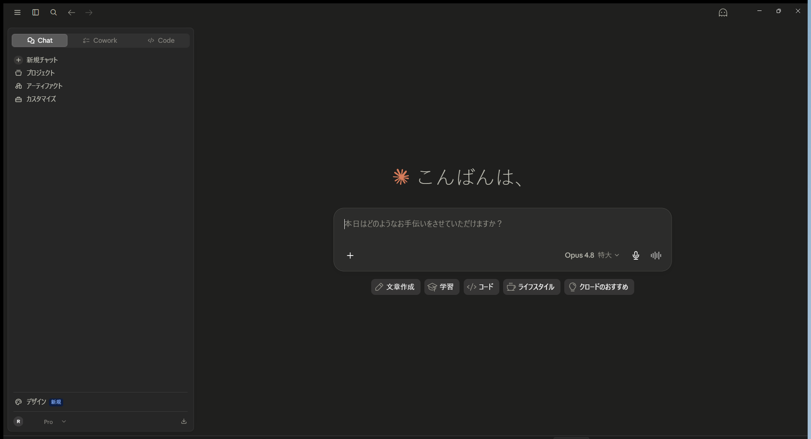

# クイックスタート

Claude Desktop を起動して、最初の会話を始めるまでの最短ルートです。

!!! tip "所要時間：約5分"
    すでにアカウントをお持ちで、アプリも入っている場合は **「3. はじめての会話」** までスキップしてOKです。

## 1. Claude Desktop を用意する（インストール確認）

まず、お使いの PC に Claude Desktop が入っているか確認します。

- **入っているか確認する** … スタートメニューまたはタスクバーで「**Claude**」を探します。あれば導入済みです。
- **入っていない場合（新規導入）** … ブラウザで [https://claude.ai/download](https://claude.ai/download) を開き、**Windows 版**をダウンロード → インストーラーを実行 → 画面の指示に従うだけです。

!!! note "🖼 画面イメージ（後日挿入予定）"
    ダウンロードページ／インストール完了後の起動画面。

## 2. ログインする

Claude Desktop を起動し、お持ちの **Claude アカウント**でサインインします。

- **アカウントがある場合** … 「ログイン」から、登録済みのメール（または Google）でサインインします。
- **アカウントが無い場合（新規作成）** … [https://claude.ai](https://claude.ai) で無料登録 → 同じアカウントで Claude Desktop にログインします。
- **契約プラン** … 通常のチャットは無料でも使えますが、**Code 機能や高度な使い方には有料プラン（Pro / Max）が必要**です。
    - **Pro** … 個人向けの基本有料プラン。日常業務にはこれで十分。
    - **Max** … 上位プラン。**利用上限が大きく**、Code や Cowork を多用しても余裕があります。ヘビーに使う方・上限に達しやすい方向け。
    - 本ガイドの環境は **Pro** です。まず Pro で始め、上限が気になれば Max に上げる、で問題ありません。

!!! note "料金・上限の詳細は公式で"
    プランの料金や利用上限は変わることがあります。最新は [https://claude.ai](https://claude.ai) のプラン案内でご確認ください。

!!! info "開発者向けの API キーは不要です"
    Claude Desktop は **アカウントのログインだけ**で使えます。`console.anthropic.com` で発行する API キーは、プログラム連携用の別物で、本ガイドの使い方では必要ありません。

!!! note "🖼 画面イメージ（後日挿入予定）"
    ログイン画面。

## 3. はじめての会話

ログインすると、次のホーム画面が開きます。これが Claude Desktop の基本の画面です。



### 画面の見方

- **① 上部タブ（Chat / Cowork / Code）** … 使い方の切り替えです。まずは **Chat**（通常の会話）でOK。[Cowork](cowork.md) と [Code](code.md) は後の章で説明します。
- **② 左サイドバー** … 「新規チャット」で新しい会話を開始、「プロジェクト」「アーティファクト」「カスタマイズ」などにアクセスできます。
- **③ 入力欄** … ここに用件を日本語で入力して送信します。
- **④ モデルと推論レベル**（入力欄の右下：例 `Opus 4.8` `特大`）… 賢さと考える深さを切り替えます。詳しくは [モデルと推論レベルの選び方](models.md)。
- **⑤ ヒントのボタン**（文章作成／学習／コード など）… 何を頼めるか迷ったときの入口です。
- **⑥ 左下のアカウント** … 契約プランの表示と、設定メニューへの入口です（[おすすめ設定](settings.md) 参照）。

!!! info "サイドバーの用語"
    - **プロジェクト** … 関連する会話や資料をまとめておく「入れ物」。案件ごとに分けると便利です。
    - **アーティファクト** … Claude が作った文書・表・コードなどの**成果物**を、別パネルで見やすく表示・保存する機能です。

### まずは話しかけてみる

入力欄に用件を打って送信するだけです。最初の一言の例：

```text
来週の役員会議の議題を3つ提案して。それぞれ狙いも一言で。
```

!!! tip "うまく使うコツ"
    «誰に・何を・どんな形で» を添えると精度が上がります。例：「**取引先向けに**、**新サービスの案内メール**を、**丁寧めの敬語で**書いて」。
    毎回の前置きを省きたい場合は、[プロフィール／カスタム指示](settings.md) に役職や会社情報を登録しておきましょう。
