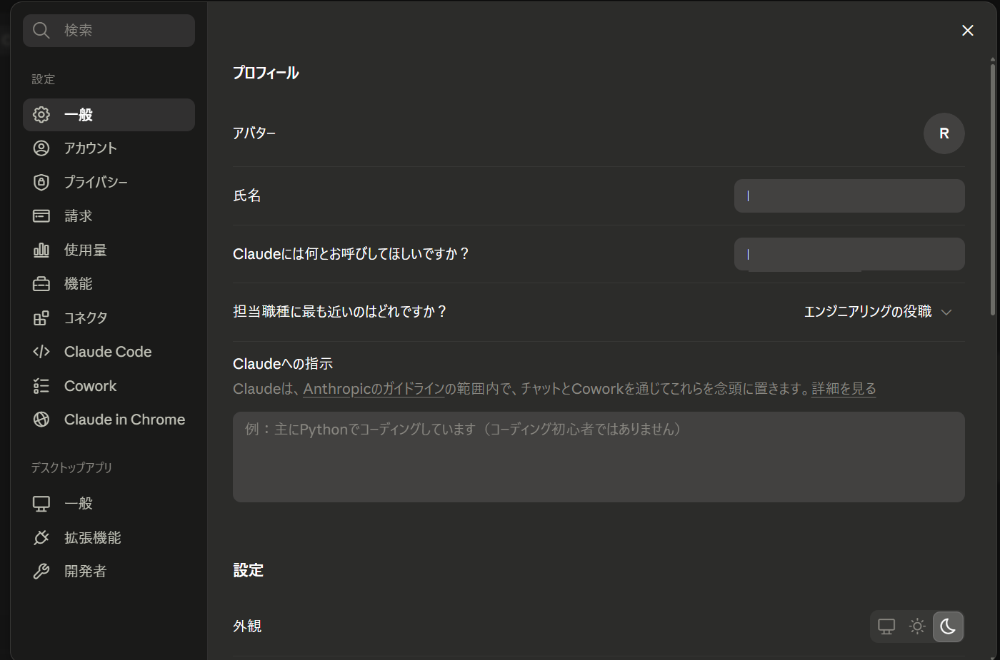
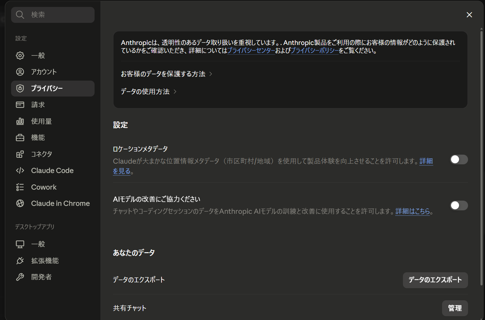

# おすすめ設定

一度設定しておくと、毎日の使い勝手が大きく変わる項目をまとめます。特に **「プロフィール／カスタム指示」「言語」「プライバシー・データ利用」** の3つは効果が大きいので、最初に整えておくのがおすすめです。

## 設定画面の開き方

画面**左下のアカウント表示**をクリックし、メニューから **「設定（Settings）」** を開きます。設定は左側にカテゴリ、右側に各項目が並ぶ構成です。



## プロフィール／カスタム指示

**最初にやっておくと一番効く設定**です。あなたの **役職・会社・専門領域・回答してほしい口調** をあらかじめ登録しておくと、毎回の前置きが不要になり、最初から自分向けの答えが返ってきます。

記入例（IT企業の経営者向け）：

```text
私はIT企業の代表（経営者）です。技術と事業の両面で意思決定します。

【情報の扱い】
- 常に1次情報（公式ドキュメント・原典・一次データ）を優先して調べ、参照した際は参照元（URL・出典）を出力に添える。
- 不確実な点や推測は「推測」と明示し、断定しない。
- 情報が古い可能性がある場合は、いつ時点のものかを添える。

【回答スタイル】
- 結論を先に、要点は箇条書きで簡潔に。
- 技術的な内容は正確に。社外向け文書は平易な日本語で。
- 重要な判断には、根拠とトレードオフ（メリット／リスク）も併記する。
```

!!! tip
    「カスタマイズ」メニュー（左サイドバー）からも、応答スタイルなどを調整できます。

!!! info "入力場所"
    上の設定画面の **「一般」** にあります。**「氏名／呼び名」「担当職種」** を選び、**「Claudeへの指示」** 欄に上の例を貼り付けます。

## 言語設定

回答が英語混じりになる場合は、言語を **日本語**に固定できます。多くは前述の「カスタム指示」に「**日本語で回答**」と書いておくだけでも安定します。

## プライバシー・データ利用

**機密情報を扱う経営者として、最初に確認しておきたい設定**です。会話の内容を **モデルの改善（学習）に使うかどうか** を切り替えられます。

- 社外秘・個人情報を扱うことが多い場合は、**学習利用をオフ**にしておくと安心です。
- 設定は後からいつでも変更できます。

!!! warning "そもそも入力しないのが最も安全"
    設定に関わらず、**パスワード・口座番号・マイナンバー等の極めて機密性の高い情報は入力しない**のが基本です。



## 通知

返信の完了通知などを受け取るかを設定できます。**長い作業を任せて他の仕事をする**ことが多い場合は、通知をオンにしておくと便利です。

## （上級者向け）開発者設定・MCP

[Code 機能](code.md) や [Claude Code CLI](cli.md)、外部ツール連携（MCP）を使う場合の設定です。通常のチャット利用では触る必要はありません。必要になったら各章で説明します。
