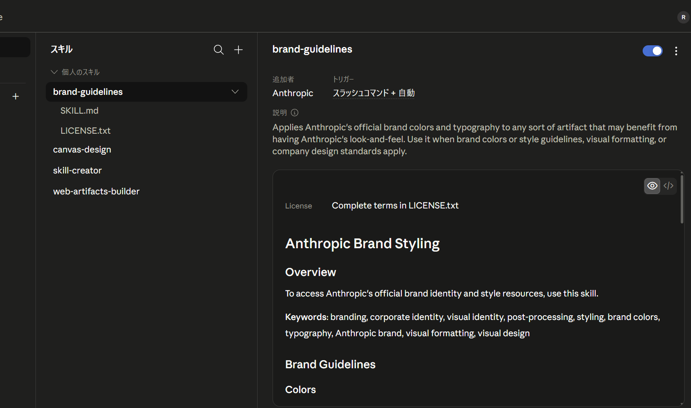
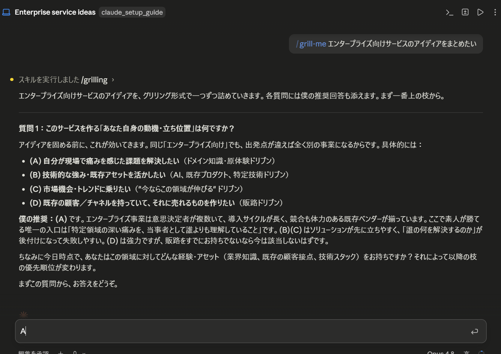

# スキル（Skills）

スキルは、特定の作業手順や専門知識をパッケージ化して Claude に追加できる仕組みです。便利な反面、**導入時の安全確認がとても大切**です。スキルは Claude に「指示」を与えるものなので、中身を確かめずに入れると、意図しない動作につながる恐れがあります。

## スキルとは

スキルは、`SKILL.md` という説明ファイルを中心とした小さなフォルダです。`SKILL.md` には、**いつ使うか（説明）** と **何をするか（指示）** が書かれています。Claude はこのファイルを読んで、必要なときにその手順を実行します。

## スキルの導入方法（3通り）

スキルの入れ方はいくつかあります。**出所が信頼できるか**を基準に選びましょう。

1. **アプリ内のディレクトリから追加する（いちばん簡単・安全）**
   「カスタマイズ」→「スキル」を開くと、Anthropic 公式・パートナー製のスキルが一覧（ディレクトリ）で表示されます。使いたいものを選んで追加するだけです。出所が明確なので安心です。
2. **プラグインの一部として入れる**
   プラグイン（関連するスキルをまとめた“道具箱”）を導入すると、その中のスキルもまとめて使えるようになります。役割（例：エンジニアリング）に合わせて選べます。
3. **手動でファイルを置く（自作・外部配布のスキル）**
   公式ディレクトリに無いスキル（自分で作ったものや、ファイルで配布されたもの）は、`SKILL.md` を所定のフォルダに置いて導入します。**出所の確認が特に重要**な方法です。

!!! tip "どれを選ぶ?"
    まずは **方法1（ディレクトリ）** が簡単・安全です。**方法3（手動）** は、自作や配布ファイルなど、ディレクトリに無いスキルを入れるときに使います。以下では、その方法3を `grill-me` を例に詳しく示します。



## 方法3の実例：grill-me ＋ grilling を手動で導入する

`grill-me` は、**`grilling` とセットの「2つで1組」**のスキルです。`grill-me` が「呼び出し用」、`grilling` が「本体（インタビューの中身）」で、**両方をそろえて**使います。

### 手順1：中身（SKILL.md）を確認する

スキルは**信頼できる配布元**のものだけを使い、入れる前に必ず中身を読みます。今回の2つは、いずれも次のとおり「指示の文章だけ」で、危険な操作はありません。

**① `grill-me`（呼び出し用）の `SKILL.md`：**

```markdown
---
name: grill-me
description: A relentless interview to sharpen a plan or design.
disable-model-invocation: true
---

Run a `/grilling` session.
```

**② `grilling`（本体）の `SKILL.md`：**

```markdown
---
name: grilling
description: Interview the user relentlessly about a plan or design. Use when the user wants to stress-test a plan before building, or uses any 'grill' trigger phrases.
---

Interview me relentlessly about every aspect of this plan until we reach a shared understanding. Walk down each branch of the design tree, resolving dependencies between decisions one-by-one. For each question, provide your recommended answer.

Ask the questions one at a time, waiting for feedback on each question before continuing. Asking multiple questions at once is bewildering.

If a question can be answered by exploring the codebase, explore the codebase instead.
```

!!! danger "ここをチェック（危険のサイン）"
    - ファイルやフォルダの**削除**、設定の**書き換え**を指示している
    - **外部URLへデータを送る**、不審なコマンドを実行する
    - 内容が**難読化**されていて読めない

    こうしたスキルは導入しないでください。

### 手順2：所定のフォルダに置く（コピー＆ペースト）

スキルは、ユーザーフォルダ内の `.claude\skills\` に、**スキルごとのフォルダ＋ `SKILL.md`** の形で置きます。

1. エクスプローラーのアドレス欄に **`%USERPROFILE%\.claude\skills`** と入力して開く（フォルダが無ければ作成します）
2. **`grilling`** フォルダを作り、その中に **`SKILL.md`** を新規作成 → 上の **②** の内容をコピーして貼り付け、保存
3. 同様に **`grill-me`** フォルダを作り、**`SKILL.md`** に上の **①** の内容を貼り付け、保存
4. **Claude Desktop を再起動**すると認識されます

最終的なフォルダ構成は次のようになります。

```text
C:\Users\<ユーザー名>\.claude\skills\
├─ grill-me\
│   └─ SKILL.md   ← ① の内容
└─ grilling\
    └─ SKILL.md   ← ② の内容
```


## チャットでの使い方

入れたスキルは、**チャットの入力欄から呼び出して**使います。

- 入力欄に **`/grill-me`** と入力して実行すると、計画を1つずつ問い詰めるインタビューが始まります。
- 使いどころ：新しい企画・システム導入・重要な意思決定の**前**に `/grill-me` を実行 → Claude が論点を順番に質問 → **抜け漏れや甘い前提を洗い出せます**。
- 1問ずつ答えていくと、最後には計画が整理された状態になります。

!!! tip
    スキルは「入れておき、必要なときに呼び出す」道具です。普段の会話の邪魔はしません。



## セキュリティ上の注意点

- **入れる前に読む** … `SKILL.md` の中身を必ず確認してから導入する
- **信頼できる出所だけ** … 配布元が分からないものは使わない
- **最小限にする** … 使うスキルだけを入れ、不要になったら外す
- **機密の扱い** … スキルが外部とやり取りする場合は、何を送るのかを確認する
